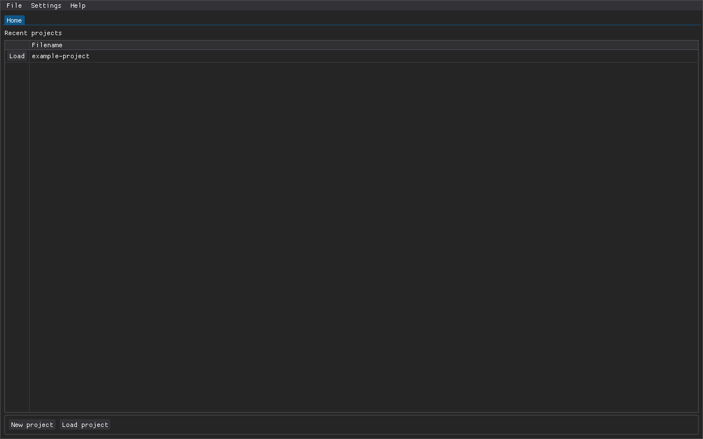
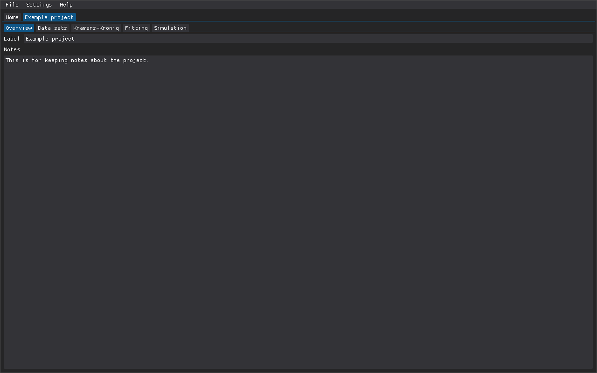
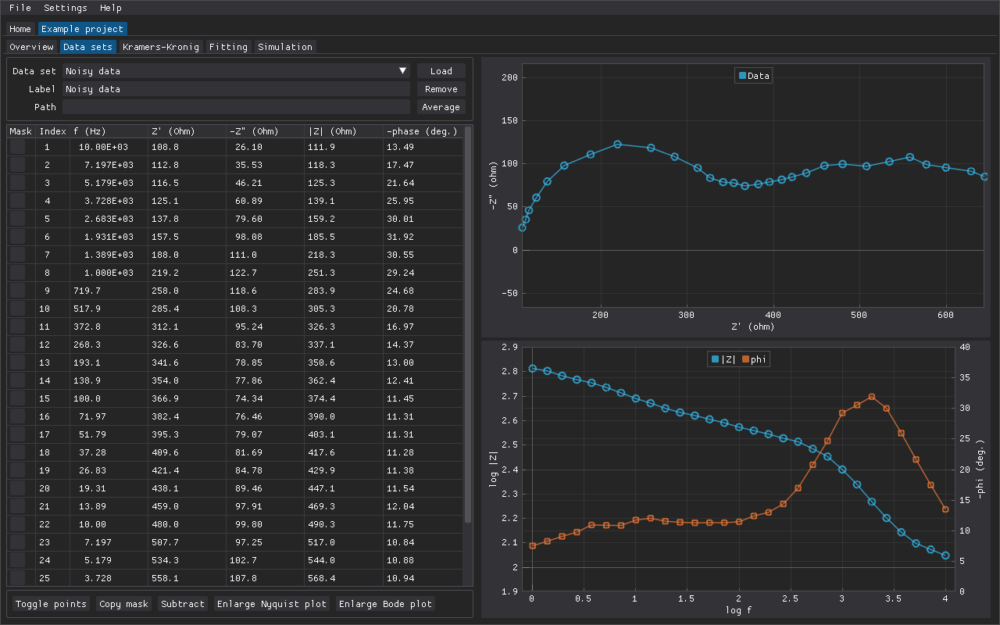
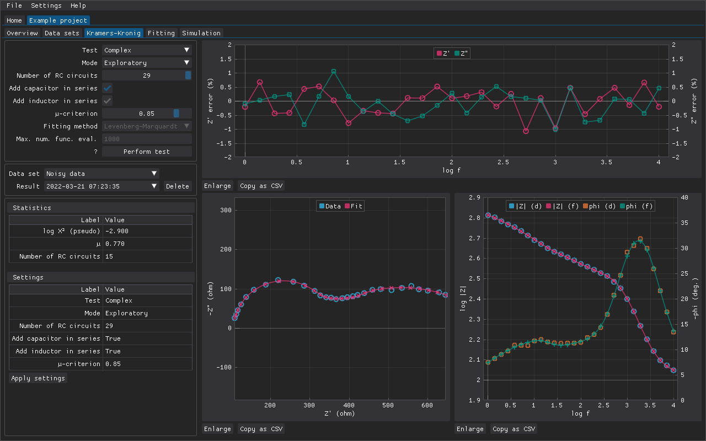
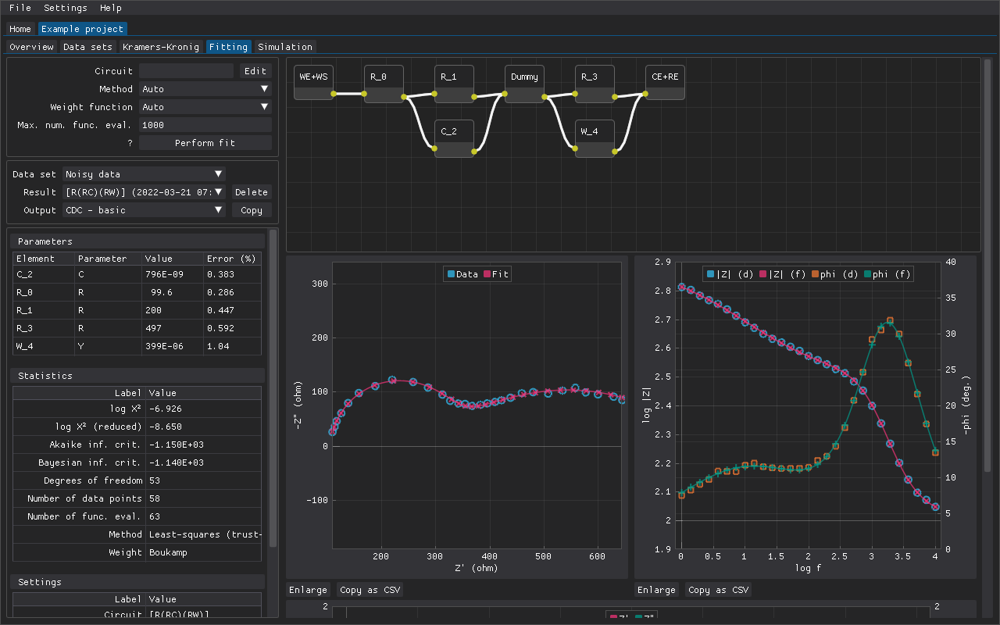
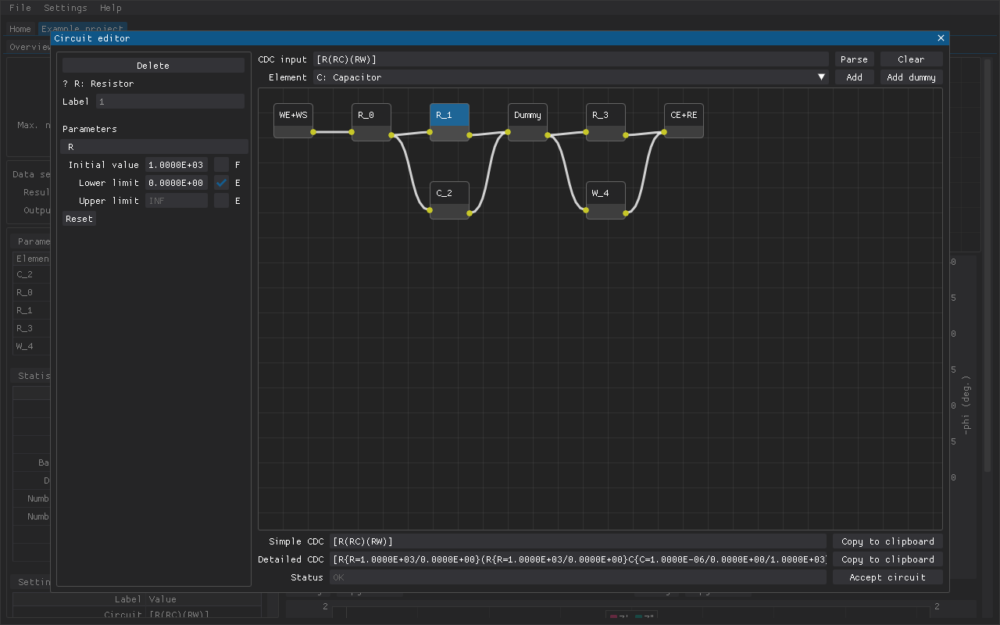
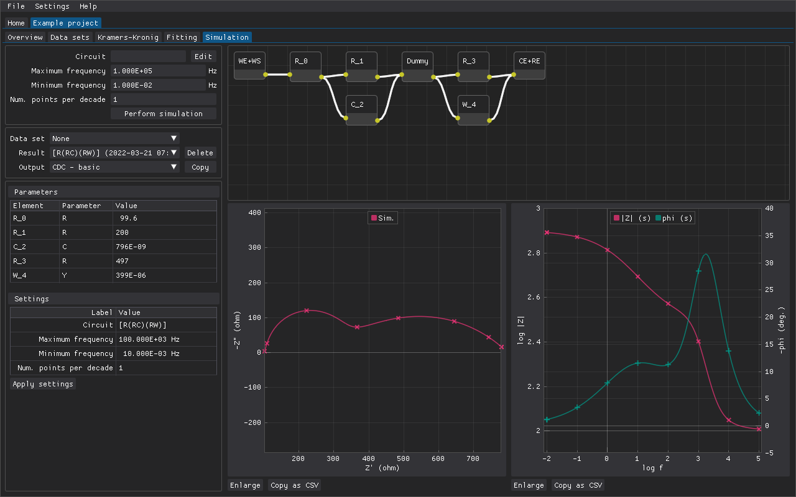

# DearEIS

A GUI program for analyzing, simulating, and visualizing impedance spectra.

## Table of contents

- [Features](#features)
    - [Overview tab](#overview-tab)
    - [Data sets tab](#data-sets-tab)
    - [Kramers-Kronig tab](#kramers-kronig-tab)
    - [Fitting tab](#fitting-tab)
    - [Simulation tab](#simulation-tab)
    - [Scripting](#scripting)
    - [Settings and keybindings](#settings-and-keybindings)
- [Contributors](#contributors)
- [License](#license)

## Features

_DearEIS_ has a project-based workflow and multiple projects can be open at the same time.

### Overview tab

The overview tab is currently only for modifying the project's label and for keeping notes.

### Data sets tab

Each project can contain multiple data sets (i.e. spectra).
Multiple noisy data sets can be averaged to produce a single data set.
Individual data points and ranges of data points can be masked so that e.g. outliers are not included in any analyses or only analyze a section of the data set at a time.
Impedances (a constant value, a circuit, or another data set) can also be subtracted from a data set to make corrections.

### Kramers-Kronig tab

Data sets can be validated by checking if they are Kramers-Kronig transformable.

### Fitting tab

Equivalent circuits can be created and fitted to a data set in order to extract information.
Various parts of the fitting results can be copied to the clipboard (e.g. the mathematical expression for the impedance of the circuit or a Markdown table containing the values of the fitted parameters).

Circuits can be created by typing in a circuit description code (CDC) or by connecting elements in the graphical circuit editor.
The initial values and the limits of the parameters of each element can be configured.

### Simulation tab

The impedance spectra of arbitrary circuits can be simulated and the circuits can be created in the same way as in the fitting tab.
The simulated spectra can also be plotted together with a data set.
Various parts of the simulated spectra can also be copied to the clipboard.

### Scripting

_DearEIS_ projects can also be used in Python scripts to batch process results (e.g. create more complex plots that contain the results of multiple fits or to generate tables that can be included in LaTeX documents).
See [the Jupyter notebook](examples/examples.ipynb) for some examples.

### Settings and keybindings

_DearEIS_ has some user-configurable settings.
It is currently possible to configure the default values of the settings on the Kramers-Kronig, fitting, and simulation tabs as well as some aspects of the plots (e.g. colors and markers).

Several keybindings, which are not currently user-configurable, are supported for keyboard-based navigation although a mouse or trackpad is required in some circumstances.
The help section in the program's menu bar contains information about the keybindings.

## Contributors

See [CONTRIBUTORS](./CONTRIBUTORS) for a list of people who have contributed to the _DearEIS_ project.

## License

Copyright 2022 DearEIS developers

_DearEIS_ is licensed under the [GPLv3 or later](https://www.gnu.org/licenses/gpl-3.0.html).

The licenses of *DearEIS*' dependencies and/or sources of portions of code are included in the LICENSES folder.

