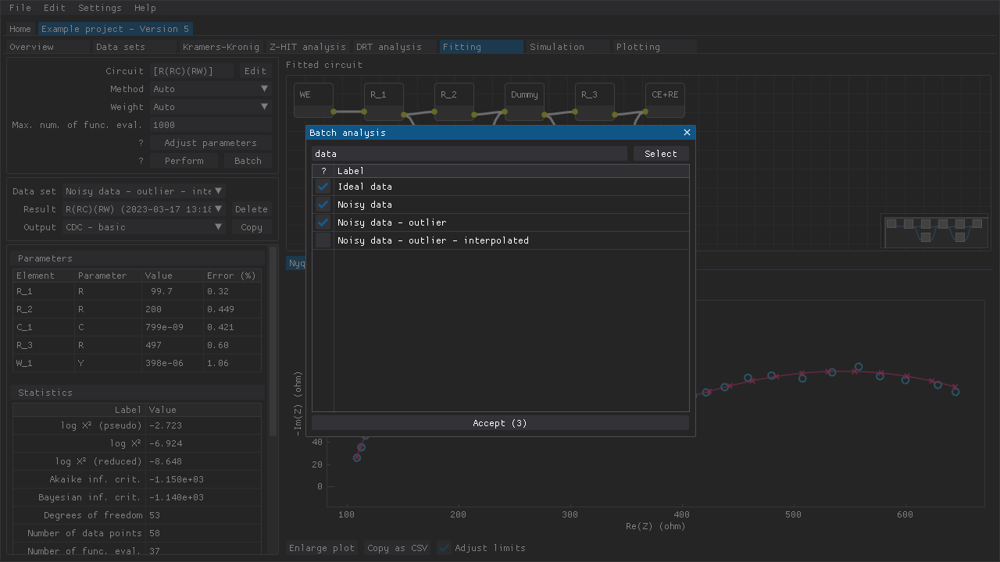

.. include:: ./substitutions.rst

Batch analysis
==============

The various tabs dedicated to performing some form of analysis also have a **Batch** button.
These buttons bring up a window (:numref:`batch_window`)where multiple data sets can be selected for inclusion in a batch analysis.

.. _batch_window:

   An example of the **Batch analysis** window where a few data sets have been selected.

.. note::

   If any errors are encountered while performing the analyses, then those errors are presented at the end.
   There is no way to cancel a batch analysis once it has been started.

.. note::

   Performing Kramers-Kronig tests in **Exploratory** mode would usually bring up a window for inspection of the intermediate results.
   This window is **NOT** shown when performing a batch analysis.

.. raw:: latex

    \clearpage

