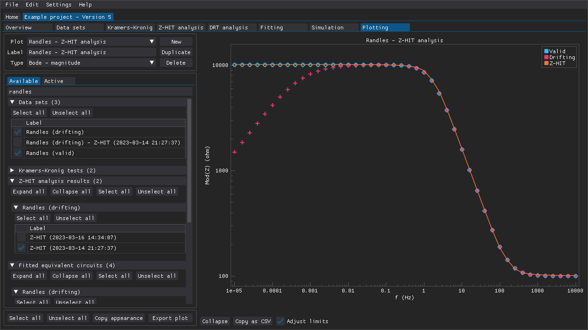
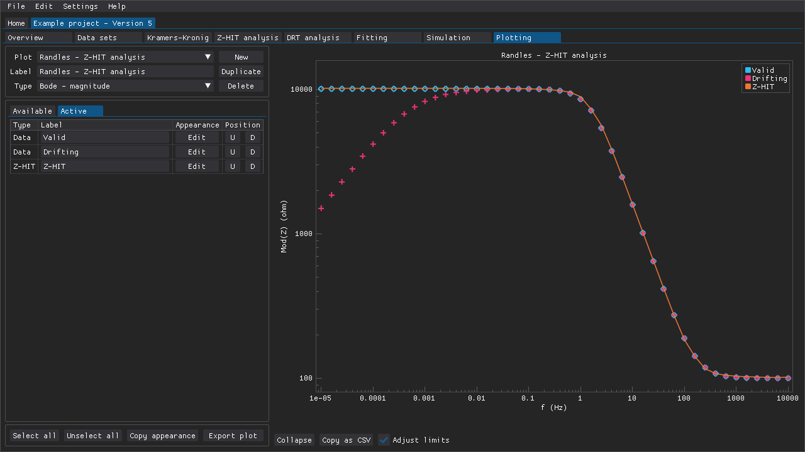
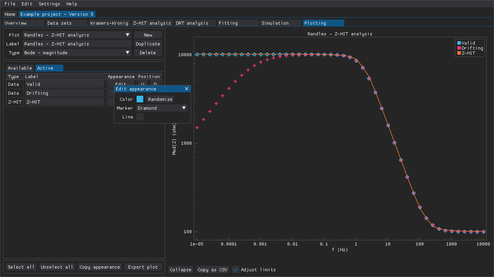
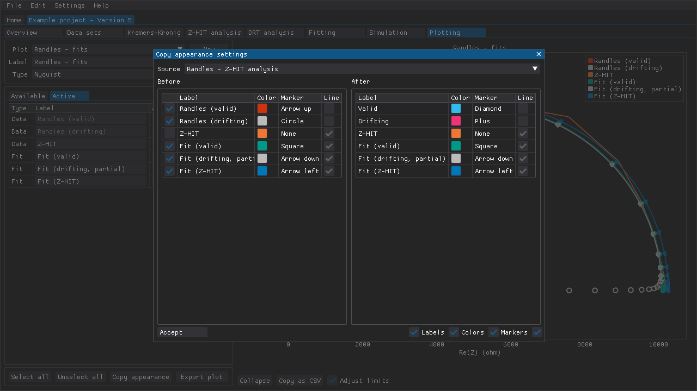
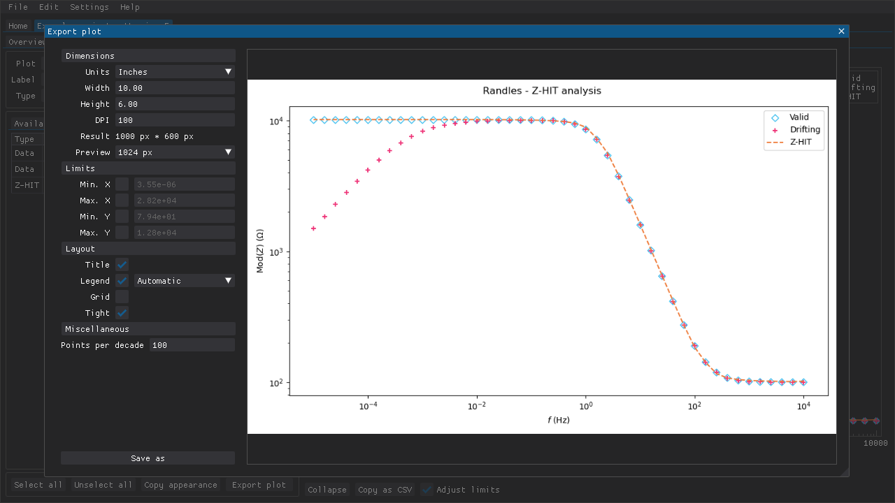

.. include:: ./substitutions.rst

Plotting
========

The **Plotting** tab (:numref:`plotting_tab`) can be used to compose plots with multiple data sets and/or analysis results.
These plots can be used just within DearEIS to compare different results side-by-side.
However, these plots can also be used to prepare relatively simple plots for sharing and/or publication.
The plot settings can also be used via the API provided by DearEIS, which means that the basic layout can be prepared via the GUI and then the final plot can be generated programmatically.
This approach would also mean that a plotting library other than `matplotlib`_, which is the default backend for exporting plots using DearEIS, could be used instead.

.. _plotting_tab:
.. figure:: images/plotting-tab.png
   :alt: The Plotting tab of a project

   The **Plotting** tab can be used to create plots containing multiple data sets and/or results.

.. raw:: latex

    \clearpage

Selecting items to plot
-----------------------

The **Available** tab (:numref:`available`) contains entries for all of the data sets, analysis results, and simulations contained within a project.
Individual items can be selected by ticking their corresponding checkboxes.

.. _available:

   Data sets and/or results can be selected from the **Available** tab.
   In this example the substring ``randles`` has been used to filter items.

The **Filter** input field can be used to search for specific items.
The labels of analysis results are treated as if they also contain the label of the data set that they belong to, which means that filtering based on a data set's label will also include the analysis results belonging to that data set.
Using a hyphen, "-", as a prefix is equal to a logical not (i.e., "-noisy" excludes items with "noisy" in their labels).
Multiple filter terms can be used by separating them with commas.
If one or more spaces, " ", are typed in this field, then all of the headings are expanded.
Similarly, if the input field is cleared, then all of the headings are collapsed.

Each heading contains buttons for (un)selecting all items within that heading and buttons for expanding/collapsing all subheadings.
There are also buttons for (un)selecting all items regardless of the heading they fall under.
Items that have been selected are added to the **Active** tab.

.. raw:: latex

    \clearpage

Customizing selected items
--------------------------

Selected items are listed in a table in the **Active** tab and several aspects of those items can be edited.
An item's label, which is used in the plot's legend, can be overridden by typing in a new label.
If one or more spaces, " ", are given as the new label, then the item will not have an entry in the legend.

.. _active:

   The label and appearance of the selected items can be modified in the **Active** tab.
   All three items have been given new labels that are used in the plot's legend.

An item's appearance (color, marker shape, and whether or not it should have a line) can be edited from the popup window that appears when clicking the **Edit** button (:numref:`edit`).
The **U** and **D** buttons can be used to adjust the order of an item when generating a plot, which affects the legend and whether or not an item will either be covered by or be covering some other item.

.. _edit:

   The **Edit appearance** window that can be used to define the color associated with a plottable item.
   The type of marker (if any) can also be chosen.
   Whether or not the item should (also) be plotted using a line can also be chosen.

If specific items should have the same appearance across multiple plots, then there are two approaches for conveniently copying the relevant settings from one plot to another.
The first approach is to have a main plot (e.g., labeled **Appearance template**) that is used simply to define the appearance of items.
This main plot can then be duplicated, which also copies each item's settings, and modified.
The second approach is to use the menu that is accessible via the **Copy appearance** button (:numref:`copy`) to copy item settings from another plot.
One can choose which plot to copy from, which items to copy settings from, and which categories of settings to copy (label, colors, etc.).

.. _copy:

   The **Copy appearance settings** window is for copying the appearance settings for multiple items from one plot to another.
   Alternatively, one can define the settings in one plot that is then duplicate the plot and make minor adjustments to the newly duplicated plot.

.. raw:: latex

    \clearpage

Exporting plots
---------------

Plots can be exported (i.e., saved as files) using `matplotlib`_ (:numref:`export`).
The plots (|PlotSettings|) and the items (|PlotSeries|) included in the plots are also accessible via the API.
This means means that one can compose a plot using the GUI and generate the final plot using the API, which allows for batch exporting and also for greater control of a plot's appearance.

.. _export:

   The **Export plot** window is for previewing and preparing to save a plot as a file.
   Some amount of customization is available, but users who desire a greater degree of control are directed to use the API of DearEIS to extract the data (and possibly also the various plot settings) in order to programmatically generate the final plots.

.. warning::

   A subset of users may encounter crashes when attempting to export plots.
   This issue appears to affect systems running Linux together with an nVidia GPU and proprietary drivers.

   Unticking the ``Clear texture registry`` setting in ``Settings > Defaults > Plotting tab - Export plot > Miscellaneous`` may resolve the issue.
   However, unticking this setting means that any memory allocated to previewing matplotlib plots is not freed until DearEIS is closed.

.. raw:: latex

    \clearpage
