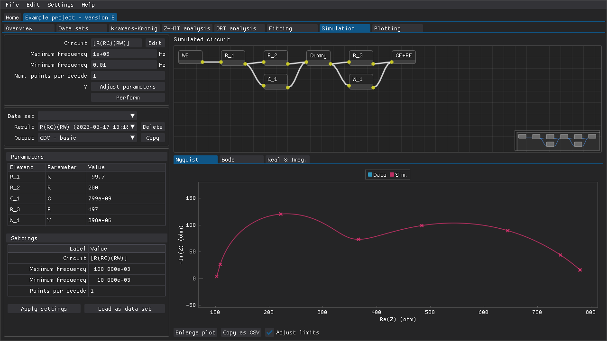

.. include:: ./substitutions.rst

Simulation
==========

The layout of the **Simulation** tab (:numref:`simulation_tab`) is similar to that of the **Fitting** tab:

- the various settings that determine the simulation parameters
- combo boxes that can be used to choose the active data set (or none), the active simulation result, and the active output
- a table of the parameter values
- a table of the settings that were used to obtain the active result

However, the purpose of the **Simulation** tab is to provide a means to simulate impedance spectra of circuits within an arbitrary range of frequencies.
The simulated impedance spectra can be loaded as data sets, which means that they can then be subjected to the various forms of analysis included in DearEIS.
The **Simulation** tab can thus be very useful for teaching, demonstration, and development purposes.

.. _simulation_tab:

   An example of where a fitted circuit's impedance response has been extrapolated outside of the frequency range of the original experimental data.

.. raw:: latex

    \clearpage
