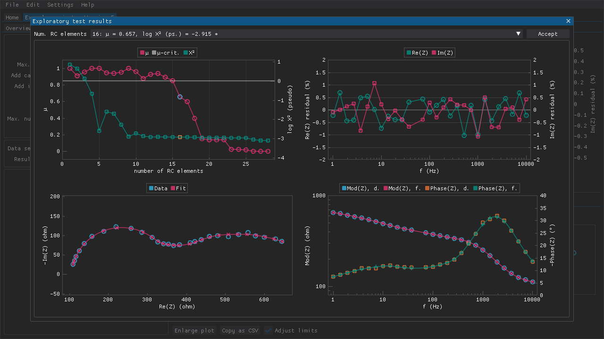
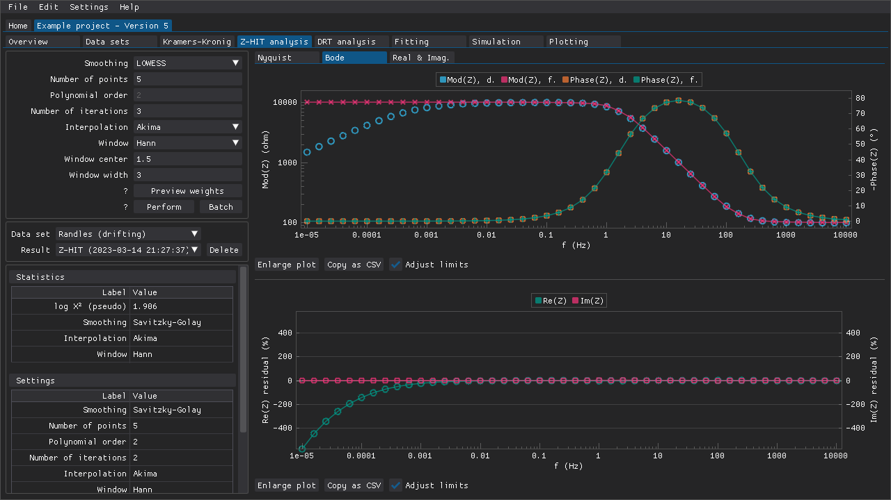
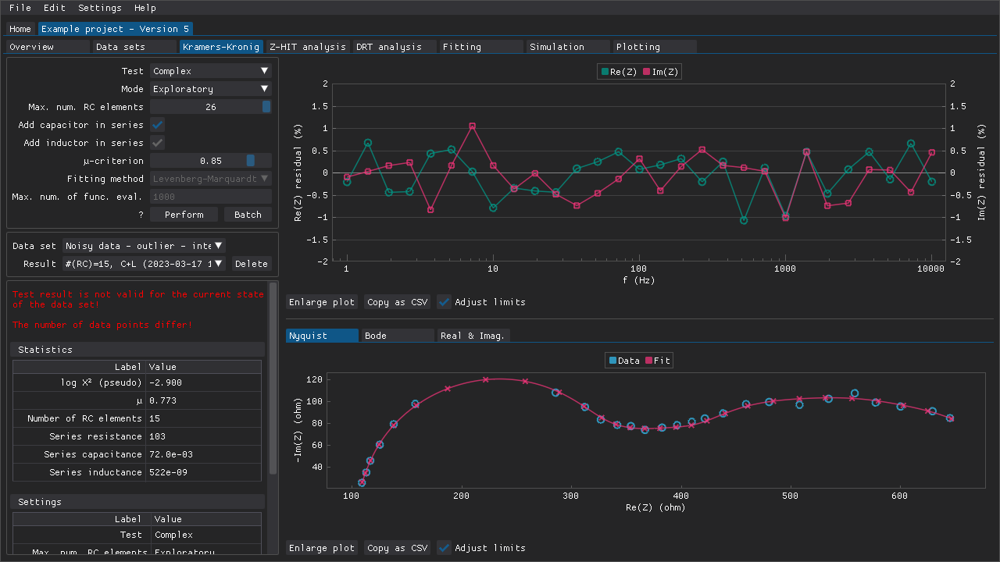

.. include:: ./substitutions.rst

Validation
==========

The two primary approaches to validating experimental data included in DearEIS are linear Kramers-Kronig testing and Z-HIT analysis.
The former is a widely adopted approach based on attempting to fit a specific type of equivalent circuit, which is known *a priori* to be Kramers-Kronig transformable.
The latter approach reconstructs the modulus data from the (typically) more stable phase data, which can reveal issues such as drift at low frequencies due to time invariant behavior exhibited by the measured system.

Kramers-Kronig testing
----------------------

Data validation based on linear Kramers-Kronig testing can be performed in the **Kramers-Kronig** tab (:numref:`kk_tab`) which contains the following:

- various settings that determine how the Kramers-Kronig test is performed
- combo boxes that can be used to choose the active data set and the active test result
- a table of statistics related to the active test result
- a table of settings that were used to obtain the active result
- different plots

.. _kk_tab:
.. figure:: images/kramers-kronig-tab.png
   :alt: The Kramers-Kronig tab of a project

   A Kramers-Kronig test result for the noisy data set with the omitted outlier.
   The relative residuals are rather large, but most importantly they are randomly distributed around zero.

The three variants of the linear Kramers-Kronig test described by `Boukamp (1995) <https://doi.org/10.1149/1.2044210>`_ have been included as well as an implementation that uses complex non-linear least squares fitting.
These tests can be performed with a fixed number of parallel RC elements (**Manual** mode) or that number can be determined automatically based on an algorithm described by `Schönleber et al. (2014) <https://doi.org/10.1016/j.electacta.2014.01.034>`_ (**Auto** mode).
The intermediate results of the latter approach can be inspected in the **Exploratory** mode as a means of detecting and dealing with false negatives (i.e., cases where valid data is indicated as invalid because the algorithm stops increasing the number of parallel RC elements too early).
An additional weight is also used in the **Exploratory** mode when suggesting the number of parallel RC elements as a means of increasing the probability of avoiding false negatives.

The test results are presented in the form of a table of statistics (e.g., |pseudo chi-squared|) and different plots such as one of the relative residuals of the fit.

Exploratory mode
~~~~~~~~~~~~~~~~

If the **Exploratory** mode is used, then the Kramers-Kronig test is performed with a range of number of parallel RC elements like when using the **Auto** mode.
However, these results are presented in a modal window for inspection (:numref:`exploratory_window`) in the form of the following plots:

- |mu| and the base-10 logarithm of |pseudo chi-squared| versus the number of parallel RC elements
- relative residuals of the real and imaginary impedances vs frequency
- Nyquist plot
- Bode plot

.. _exploratory_window:

   The plot of |mu| fluctuates a bit at low numbers of parallel RC elements in this example, but wilder fluctuations can in some cases (depending on the chosen |mu|-criterion) result in a false negative when using the **Auto** mode.
   Another number of parallel RC elements could be chosen, if necessary, from this window.

The |mu| values range from 0.0 to 1.0 and these extremes represent over- and underfitting, respectively (see Schönleber et al. (2014) for the more information about how |mu| is calculated).
The |mu|-criterion is the threshold that is used to decide when to stop adding more parallel RC elements (i.e., when |mu| drops below the chosen |mu|-criterion).

The main advantage of using the **Exploratory** mode is that one can see how |mu| changes as a function of the number of parallel RC elements.
In some cases |mu| can fluctuate wildly at low numbers of parallel RC elements, which would otherwise lead to the algorithm stopping too early and make it seem like the data is invalid when that is not necessarily the case.

References:

- Boukamp, B.A., 1995, J. Electrochem. Soc., 142, 1885-1894
- Schönleber, M., Klotz, D., and Ivers-Tiffée, E., 2014, Electrochim. Acta, 131, 20-27

.. raw:: latex

    \clearpage

Z-HIT analysis
--------------

Data validation using the `Z-HIT algorithm <https://en.wikipedia.org/wiki/Z-HIT>`_ can be performed in the **Z-HIT analysis** tab (:numref:`zhit_tab`) that contains the following:

- the various settings that determine how the Z-HIT analysis is performed
- combo boxes that can be used to choose the active data set and the active analysis result
- a table of statistics related to the active analysis result
- a table of the settings that were used to obtain the active result
- different plots

.. _zhit_tab:

   The modulus data that is plotted in the upper plot has been reconstructed (red line) based on the phase data (orange markers and green line) of some example data that exhibits drift at low frequencies (blue markers).

The Z-HIT algorithm was first described by Ehm et al. (2000) and provides a means of validating recorded impedance spectra using a modified logarithmic Hilbert transformation.
The phase data is typically smoothed before it is interpolated using a spline, and then it is integrated and derivated to reconstruct the modulus data.
The final step is an adjustment of the offset of the reconstructed modulus data by fitting to a subset of the experimental data that is unaffected by, e.g., drift.
This subset of data points is typically in the range of 1 Hz to 1000 Hz.

.. note::

   The modulus data is not reconstructed perfectly.
   There are often minor deviations even with ideal data.

DearEIS offers a few options for smoothing algorithm and interpolation spline, and several different window functions for the weights to use during offset adjustment.
The weights can also be previewed in a window (:numref:`weights_window`) that is accessible via the **Preview weights** button that is located below the section for settings.
This window can help with selecting a window function and appropriate parameters for it.

.. _weights_window:
.. figure:: images/zhit-tab-weights.png
   :alt: A window for previewing weights

   It is possible to preview the weights that could be applied when fitting the approximated modulus data to the experimental modulus data.
   The shaded region shows the position of the window function while the orange markers show the weight (from 0.0 to 1.0) that could be applied.

The results are presented in the form of a table of statistics and different plots.

References:

- Ehm, W., Göhr, H., Kaus, R., Röseler, B., and Schiller, C.A., 2000, Acta Chimica Hungarica, 137 (2-3), 145-157.

.. raw:: latex

    \clearpage

Applying old settings and masks
-------------------------------

The settings that were used to perform the active test result are also presented as a table and these settings can be applied by pressing the **Apply settings** button.

The mask that was applied to the data set when the test was performed can be applied by pressing the **Apply mask** button.
If the mask that is applied to the data set has changed since an earlier analysis was performed, then that will be indicated clearly above the statistics table.

   
   An example of the warning (red text on the left-hand side) that could be shown if, e.g., the mask applied to a data set has been changed after an analysis has been performed.
   In this case, three points near the apex of the semi-circle on the left-hand side in the Nyquist plot have been omitted.

These features make it easy to restore old settings/masks in case, e.g., DearEIS has been closed and relaunched, or after trying out different settings.

.. raw:: latex

    \clearpage
