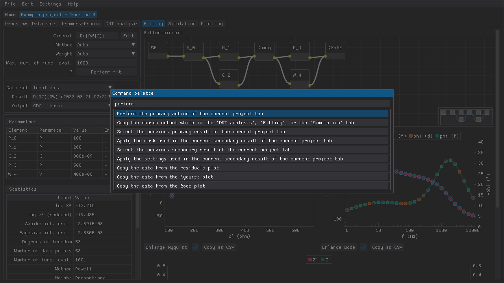

<!--
TODO:
- Screenshot(s)
-->

## Command palette

The command palette can be used for a more keyboard-centric approach to using DearEIS (see figure below).

Figure: Example of the command palette, which has been opened while the user was in the `Fitting` tab.
The user has typed in `perform` in order to then perform a fit once the `Enter` key is pressed.

The command palette is a modal window that can be accessed via the [assigned hotkey](settings.md) (`Ctrl+P` by default).
The modal window contains a text input, which can be used to search for an action that is available in the current context (e.g., the `Data sets` tab of the active project), and below it is a list of those actions.
The up and down arrow keys as well as the `Page Down`, `Page Up`, `Home` and `End` keys can be used to navigate the list of actions.
The highlighted action can be executed by pressing the `Enter` key and the modal window can be closed without executing an action by pressing the `Esc` key.