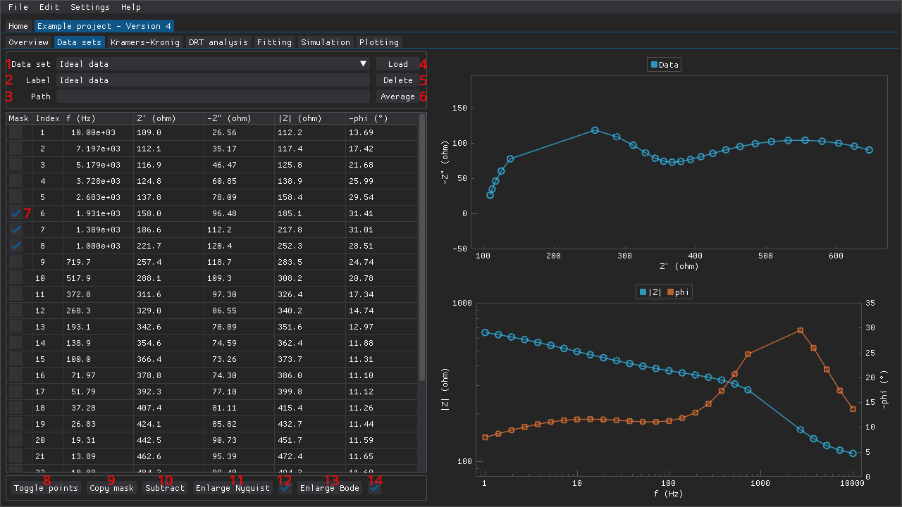
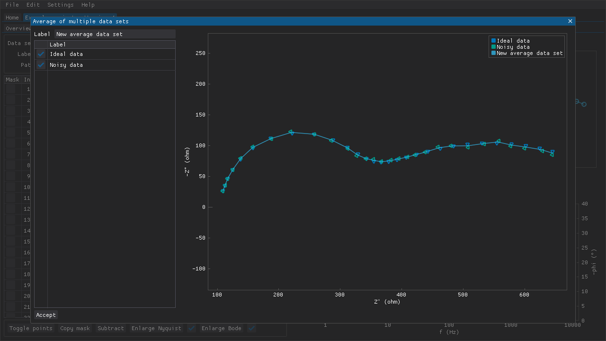
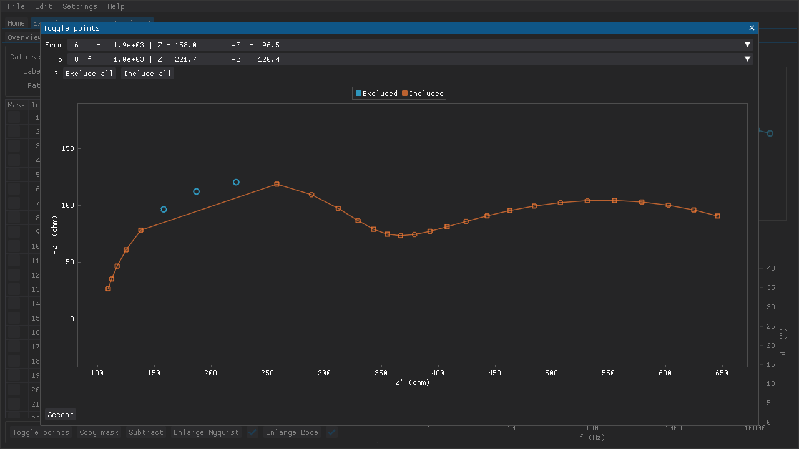
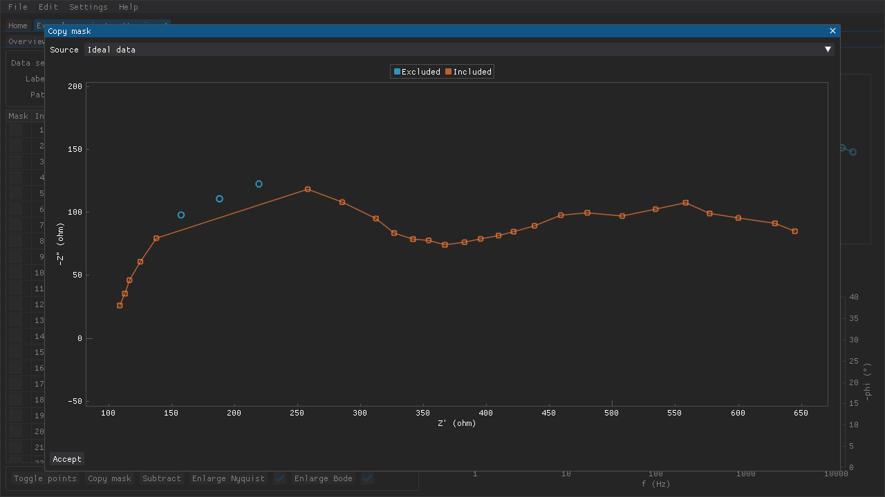
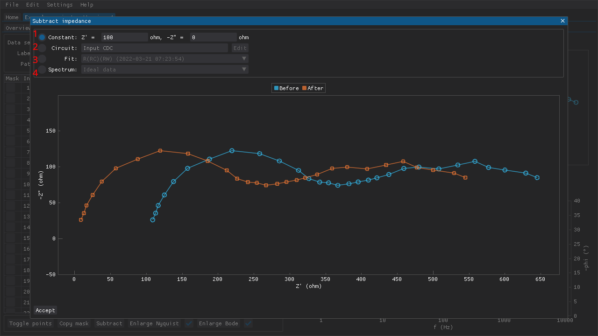

<!--
TODO:
- Screenshot(s)
-->

**Table of Contents**

- [The `Data sets` tab](#the-data-sets-tab)
- [Supported file formats](#supported-file-formats)
- [Averaging data sets](#averaging-data-sets)
- [Masking data points](#masking-data-points)
- [Correcting data sets](#correcting-data-sets)

## The `Data sets` tab

Experimental data, which is referred to as *data sets* in the program, can be loaded in the `Data sets` tab (see figure below):

  1. `Data set` combo: use this combo box (or the [hotkeys](settings.md)) to switch between data sets.
  2. `Label` input: the label associated with the data set can be modified.
  3. `Path` input: the file path that was used when loading the impedance spectrum. This value can also be modified but it is primarily for keeping track of which file the data set corresponds to when the label has been modified from its default value.
  4. `Load` button: opens up a file selection window for loading data sets from one or more files.
  5. `Delete` button: remove the currently active data set from the project.
  6. `Average` button: open a window where two or more data sets can be chosen and a new average data set is created.
  7. `Mask` checkboxes: each data point can be masked individually.
  8. `Toggle points` button: open a window for masking a range of points at once.
  9. `Copy mask` button: open a window where another data set's mask can be chosen and applied to the active data set.
  10. `Subtract` button: open a window where corrections can be made to the active data set by subtracting impedances.
  11. `Enlarge Nyquist` button: show a larger version of the Nyquist plot.
  12. Nyquist plot limits checkbox: automatically adjust the limits of the Nyquist plot when switching between data sets.
  13. `Enlarge Bode` button: show a larger version of the Bode plot.
  14. Bode plot limits checkbox: automatically adjust the limits of the Bode plot when switching between data sets.

Figure: The `Data sets` tab of a project.

DearEIS projects can contain multiple data sets.
The data points of a data set are presented in the form of a table and as both Nyquist and Bode plots.

## Supported file formats

Several different file formats are supported:

- BioLogic: `.mpt`
- Eco Chemie: `.dfr`
- Gamry: `.dta`
- Ivium: `.idf` and `.ids`
- Spreadsheets: `.xlsx` and `.ods`
- Plain-text character-separated values (CSV)

Additional file formats may be supported in the future.

Not all CSV files and spreadsheets are necessarily supported as-is but the parsing of those types of files should be quite flexible.
The parsers expect to find at least a column with frequencies (Hz) and columns for either the real and imaginary parts of the impedance (ohm), or the absolute magnitude (ohm) and the phase angle/shift (degrees).
The supported column headers are:

- frequency: `frequency`, `freq`, or `f`
- real: `z'`, `z_re`, `zre`, `real`, or `re`
- imaginary: `z"`, `z''`, `z_im`, `zim`, `imaginary`, `imag`, or `im`
- magnitude: `|z|`, `z`, `magnitude`, `modulus`, `mag`, or `mod`
- phase: `phase`, `phz`, or `phi`

The identification of column headers is case insensitive (i.e., `Zre` and `zre` are considered to be the same).
The sign of the imaginary part of the impedance and/or the phase angle/shift may be negative, but then that has to be indicated in the column header with a `-` prefix (e.g., `-Zim` or `-phase`).

## Averaging data sets

If multiple repeated measurements have been performed with the same sample, then these can be averaged to obtain a less noisy spectrum.
This can be done by pressing the `Average` button, choosing the data sets to average, choosing a name (`Average` by default) for the new data set, and finally accepting the result.

Figure: The chosen data sets are plotted using markers while the resulting average is plotted as a line.

## Masking data points

Masks can be applied to hide data points in several ways.
This feature can be used to get rid of outliers or to analyze a fragment of a data set.
Individual data points can be masked via the checkboxes along the left-hand side of the table of data points.
Ranges of data points can be toggled via the window that can be accessed by pressing the `Toggle points` button below the table of data points.
This can be used to, e.g., quickly mask multiple points or to remove the mask from all points.
Middle-mouse clicking and dragging a region in the Nyquist plot can also be used to choose the affected points.

Figure: The `Toggle points` feature allows a range of data points to be (un)masked at once without having to tick each checkbox individually.

If multiple data sets will need to have the same (or very similar) masks, then the `Copy mask` button can be used to copy the applied masks from another data set to the active data set.

Figure: The `Copy mask` features allows an existing mask to be copied from one data set and applied to another.

## Correcting data sets

Corrections can be made to data sets via the window that can be accessed by pressing the `Subtract` button below the table of data points.
This can be used to remove, e.g., inductance resulting from cables used to connect the measurement instrument to the sample.
The impedance(s) can be one of the following (see figure below):

  1. a fixed impedance
  2. a circuit
  3. a fit result
  4. a spectrum (i.e., data set)

Figure: The `Subtract` feature allows corrections to be made to data sets. In this example a series resistance of 100 ohm is subtracted.

See the section on [fitting](fitting.md) for information about how to construct a circuit.