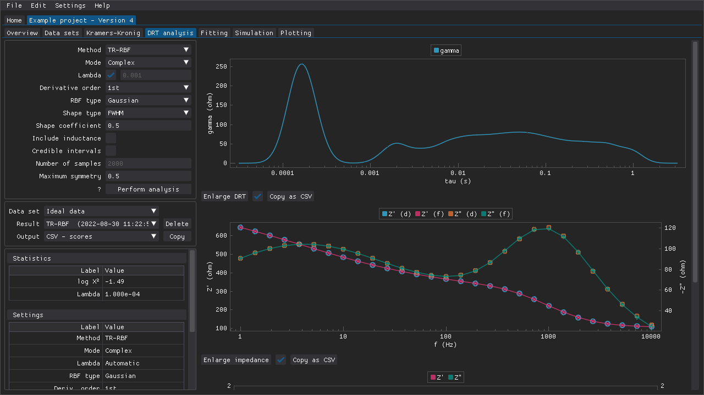

<!--
TODO:
- Screenshot(s)
-->

**Table of Contents**

- [Performing analyses](#performing-analyses)
- [Applying old settings](#applying-old-settings)
- [Applying old masks](#applying-old-masks)
- [Copying results to the clipboard](#copying-results-to-the-clipboard)

## Performing analyses

The distribution of relaxation times (DRT) can be calculated using multiple different approaches (see the corresponding publications for details):

- [Bayesian Hilbert transform (BHT)](https://doi.org/10.1016/j.electacta.2020.136864)
- [Tikhonov regularization and non-negative least squares fitting (TR-NNLS)](https://doi.org/10.1039/D0CP02094J)
- [Tikhonov regularization and radial basis function (or piecewise linear) discretization (TR-RBF)](https://doi.org/10.1016/j.electacta.2015.09.097)
- [multi-(RQ) fit (m(RQ)fit)](https://doi.org/10.1016/j.electacta.2014.12.059)

This type of analysis can be used, e.g., as an aid when developing equivalent circuits by revealing the number of time constants.
The peak shapes (e.g., symmetry and sharpness) can also help with identifying circuit elements that could be suitable.

The results are presented in the form of one or more tables (e.g., statistics, scores) and three plots (gamma vs tau, real and negative imaginary impedance vs frequency, and relative errors of the fit).

Figure: The `DRT analysis` tab of a project.

## Applying old settings

The settings that were used to perform the active analysis result are also presented as a table and these settings can be applied by pressing the `Apply settings` button.

## Applying old masks

The mask that was applied to the data set when the analysis was performed can be applied by pressing the `Apply mask` button.
If the mask that is applied to the data set has changed since an earlier analysis was performed, then that will be indicated clearly above the statistics table.

## Copying results to the clipboard

Some results can be copied to the clipboard in different plain-text formats via the `Output` combo box and the `Copy` button.
