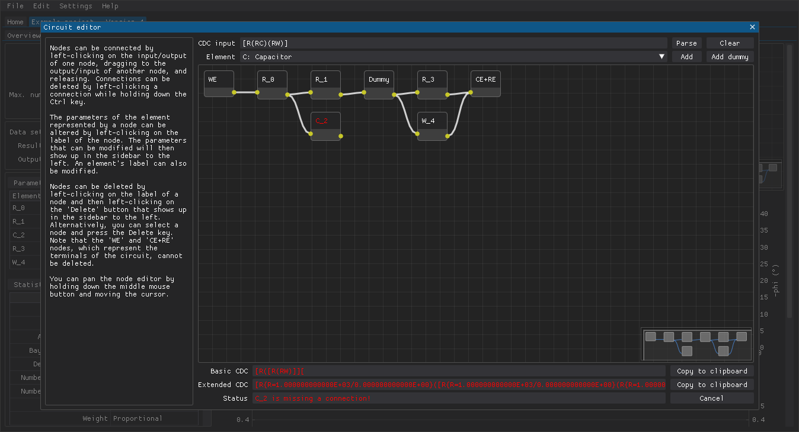

<!--
TODO:
- Mention the dummy cell
-->

**Table of Contents**

- [Performing fits](#performing-fits)
- [Equivalent circuits](#equivalent-circuits)
- [Applying old settings](#applying-old-settings)
- [Applying old masks](#applying-old-masks)
- [Copying results to the clipboard](#copying-results-to-the-clipboard)

## Performing fits

The `Fitting` tab is where equivalent circuits can be fitted to data sets (see figure below):

  1. the various settings that determine how the fitting is performed
  2. combo boxes that can be used to choose the active data set, the active fit result, and the active output (buttons for deleting the active fit result and for copying the active output are also included)
  3. a table of fitted parameter values and estimated errors (if possible to estimate)
  4. a table of statistics related to the active fit result
  5. the settings that were used to obtain the active result (not shown here but is positioned below the table of statistics)

Figure: The `Fitting` tab of a project.

Equivalent circuits can be constructed either by typing in a corresponding [circuit description code (CDC)](https://www.utwente.nl/en/tnw/ims/publications/downloads/cdc-explained.pdf) or by using the graphical circuit editor, which is accessible by pressing the `Edit` button.

Different iterative methods and weights are available.
If one or both of these settings are set to `Auto`, then combinations of iterative method(s) and weight(s) are used to perform multiple fits in parallel and the best fit is returned.

The results are presented in the form of a table containing the fitted parameter values (and, if possible, error estimates for the fitted parameter values), a table containing statistics pertaining to the quality of the fit, three plots (Nyquist, Bode, and relative errors of the fit), and a preview of the circuit that was fitted to the data set.
If you hover the mouse cursor over cells in the tables, then you can get additional information (e.g., more precise values or explanations).

## Equivalent circuits

The CDC syntax is quite simple:

- Circuit elements are represented by one or more letter symbols such as `R` for a resistor, `C` for a capacitor, and `Wo` for a Warburg diffusion of finite-length with a reflective boundary.
- Two or more circuit elements enclosed in parentheses, `()`, are connected in parallel.
- Two  or more circuit elements enclosed in square brackets, `[]`, are connected in series. This can be used to construct, e.g., a parallel connection that contains a nested series connection (`(C[RW])` where `R` and `W` are connected together in series and that series connection is in parallel with `C`).

DearEIS also supports an extended CDC syntax.
This extended syntax allows for defining circuit elements with, e.g., labels, initial values for parameters, and parameter limits.
Circuit elements can be followed up by curly braces and the aforementioned things can be defined within these curly braces.
For example, `R{R=250f:ct}` defines a resistor with:

- an initial value of 250 ohms for the resistance `R`
- a fixed initial value (i.e., a constant value)
- the label `ct`, which stands for charge transfer
  
Engineering notation (e.g., `1e-6` or `1E-6` instead of `0.000001`) is supported by the extended syntax.
All parameters do not need to be defined if a circuit element has multiple parameters.
If parameters are omitted, then the default values are used (e.g., the default initial value for the `R` parameter of a resistor is 1000 ohms).
If parameter limits are completely omitted, then the default values are used (e.g., the default lower limit for the `R` parameter of a resistor i 0 and the upper limit is infinity).
`Q{Y=1.3e-7//1e-5,n=0.95/0.9/1.0:dl}` defines a constant phase element with:

- an initial value of 1.3 \* 10^-7 F\*s^(n-1) for the `Y ` parameter (other source may use the notation `A` or `Q0` for this parameter) with no lower limit and an upper limit of 1 \* 10^-5 F\*s^(n-1)
- an initial value of 0.95 for the `n` parameter (other sources may use the notation `alpha` or `psi` for this parameter) with a lower limit of 0.9 and an upper limit of 1.0
- the label `dl`, which stands for double-layer (i.e., double-layer capacitance)

The valid symbols are listed in the `Element` combo box positioned below the `CDC input` field.

Alternatively, nodes representing the circuit elements can be added to the node editor and connected together to form an equivalent circuit.
This is done by choosing the type of circuit element one wants to add, clicking the `Add` button, and finally linking nodes together by clicking and dragging between the terminals of the nodes  (i.e., the yellow dots on either side of a node).
If two parallel circuits are connected in series like in the figure below, then it is necessary to place a node between them.
This node could be an element (e.g., a resistor) that is also connected in series to the two parallel circuits or it could be a dummy node.
This dummy node, which can be added via the `Add dummy` button, does not affect the impedance of the system at all.
Links between nodes can be deleted by either clicking on a link and then pressing the `Delete` button on the keyboard, or by holding down `Ctrl` when clicking on a link.
Multiple nodes can be moved or deleted by clicking and dragging a selection box around them.

Clicking a node will update the area on the left-hand side.
This is where a label such as `ct` for charge transfer can be added to a circuit element.
More importantly, this is where initial values and limits can be defined for the parameters of a circuit element.
One can also set a parameter to have a fixed value.

**IMPORTANT!** Due to technical reasons, one must click on the upper part of a node (i.e., where the label is) that represents a circuit element in order to be able to define, e.g., custom initial values.
Also, any values typed into the input fields must be confirmed by pressing `Enter` or the value will not actually be set.

Figure: The graphical circuit editor can be used to construct equivalent circuits and/or to define the initial values and limits of parameters.

Press the `Accept circuit` button in the bottom right-hand corner once the equivalent circuit is complete.
If there is an issue with the equivalent circuit (e.g., a missing or invalid connection), then the button will be labeled `Cancel` instead.
The `Status` field at the bottom of the window should offer some help regarding the nature of the issue and the affected node should be highlighted with a red label (see figure below).

<!--
TODO: Add a screenshot demonstrating a circuit that is not valid
-->

Figure: The graphical circuit editor can be used to construct equivalent circuits and/or to define the initial values and limits of parameters.

## Applying old settings

The settings that were used to perform the active fitting result are also presented as a table and these settings can be applied by pressing the `Apply settings` button.

## Applying old masks

The mask that was applied to the data set when the fitting was performed can be applied by pressing the `Apply mask` button.
If the mask that is applied to the data set has changed since an earlier fitting was performed, then that will be indicated clearly above the statistics table.

<!--
TODO: Add a screenshot demonstrating a result that is not valid anymore
-->

## Copying results to the clipboard

Some results can be copied to the clipboard in different plain-text formats via the `Output` combo box and the `Copy` button.
For example, the following results can be copied:

- the basic or extended CDC of the fitted circuit
- a table of the impedance response of the fitted circuit as character-separated values
- a table of the fitted parameters as, e.g., character-separated values.
- a circuit diagram of the fitted circuit as, e.g., LaTeX or Scalable Vector Graphics (see figure below)
- the [SymPy](https://www.sympy.org/) expression describing the impedance of the fitted circuit

Figure: Example of a circuit diagram copied as Scalable Vector Graphics.
