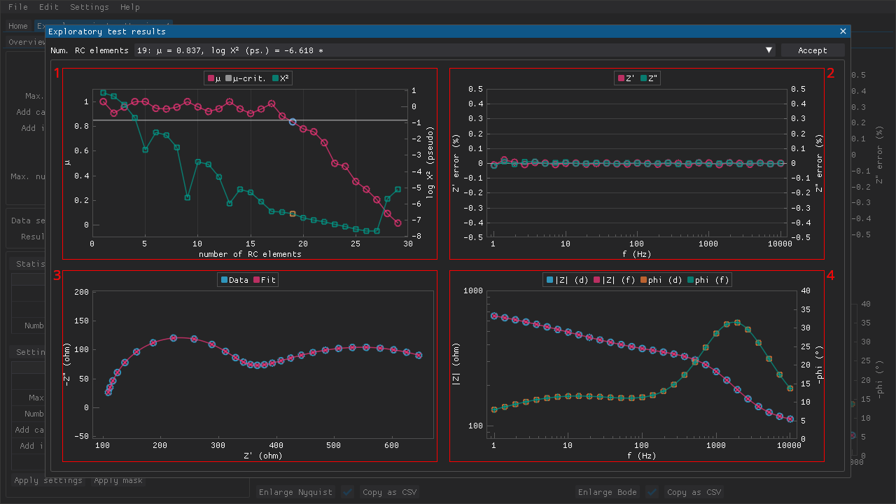

<!--
TODO:
- Screenshot(s)
-->

**Table of Contents**

- [Performing tests](#performing-tests)
- [Exploratory mode](#exploratory-mode)
- [Applying old settings](#applying-old-settings)
- [Applying old masks](#applying-old-masks)

## Performing tests

Data validation tests based on Kramers-Kronig transformations can be performed in the `Kramers-Kronig` tab (see figure below):

  1. the various settings that determine how the Kramers-Kronig test is performed
  2. combo boxes that can be used to choose the active data set and the active test result, and a button for deleting the active test result
  3. a table of statistics related to the active test result
  4. the settings that were used to obtain the active result

Figure: The `Kramers-Kronig` tab of a project.

The three variants of the [linear Kramers-Kronig test](https://doi.org/10.1149/1.2044210) have been included as well as an implementation that uses complex non-linear least squares fitting instead.
These tests can be performed with a fixed number of parallel RC circuits (`Manual` mode) or that number can be [determined automatically based on an algorithm](https://doi.org/10.1016/j.electacta.2014.01.034) (`Auto` mode).
The `Exploratory` mode allows the intermediate results of the latter approach to be inspected as a means of detecting and dealing with false negatives (i.e., cases where valid data is indicated as invalid because the algorithm stops increasing the number of parallel RC circuits too early).
An additional weight is also used when suggesting the number of parallel RC circuits.

The test results are presented in the form of a table of statistics (e.g., chi-squared value) and three plots (relative errors of the fit, Nyquist, and Bode).

## Exploratory mode

If the `Exploratory` mode is used, then the Kramers-Kronig test is performed with a range of number of parallel RC circuits like when using the `Automatic` mode.
However, these results are presented in a modal window for inspection (see figure below):

  1. plots of μ and the base-10 logarithm of the pseudo chi-squared vs the number of parallel RC circuits
  2. relative error of the real and imaginary impedances vs frequency
  3. Nyquist plot
  4. Bode plot

Figure: The `Exploratory` mode allows inspection of the intermediate results that the `Automatic` mode produces but would normally be hidden from the user. This can help to avoid false negatives that would lead one to dismiss a data set as invalid despite being valid.

The μ-values range from zero to one and these extremes represent over- and underfitting, respectively (see [this article](https://doi.org/10.1016/j.electacta.2014.01.034) for the more information about how this value is calculated).
The μ-criterion is the threshold that is used to decide when to stop adding more parallel RC circuits based whether or not the μ-value has dropped below this threshold.

The advantage of using the `Exploratory` mode is that one can see how the μ-value changes as a function of the number of parallel RC circuits.
In some cases the μ-value can fluctuate wildly at low numbers of parallel RC circuits, which can lead to the algorithm stopping too early and making it seem like the data is invalid when that is not necessarily the case.

## Applying old settings

The settings that were used to perform the active test result are also presented as a table and these settings can be applied by pressing the `Apply settings` button.

## Applying old masks

The mask that was applied to the data set when the test was performed can be applied by pressing the `Apply mask` button.
If the mask that is applied to the data set has changed since an earlier test was performed, then that will be indicated clearly above the statistics table.

Figure: If the mask applied to the data set differs from the result that is being viewed, then the program will indicate that (see the red text on the left-hand side).