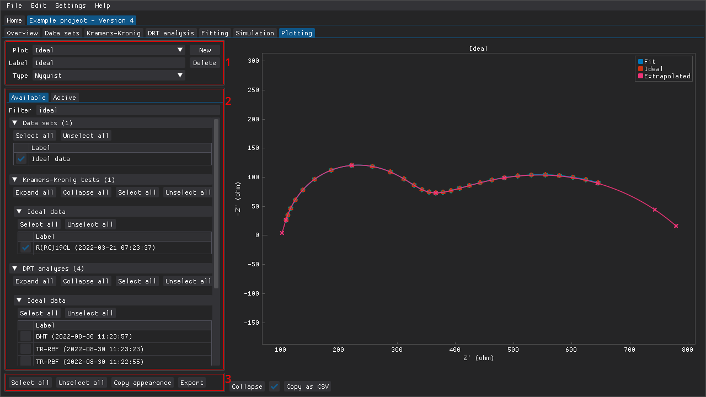
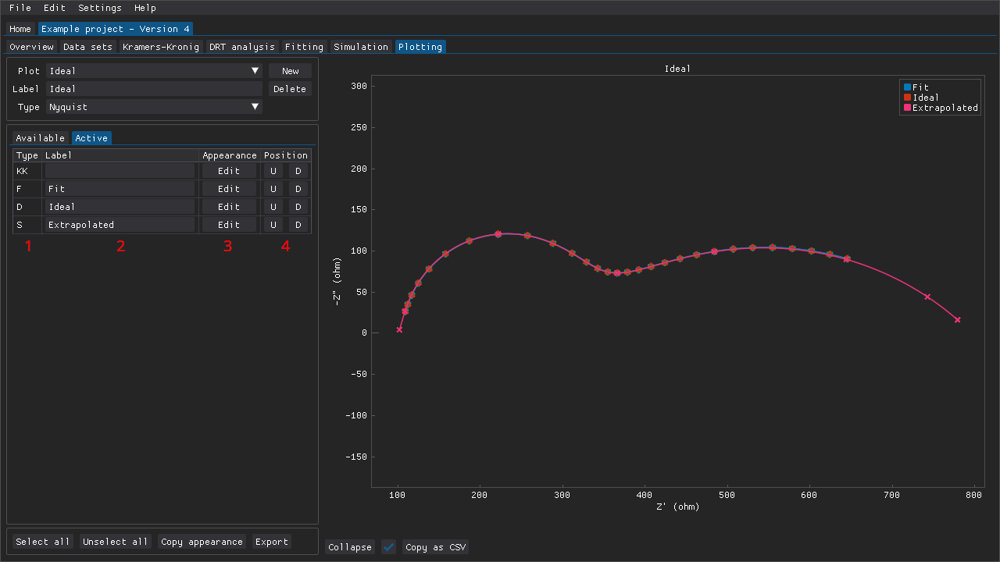
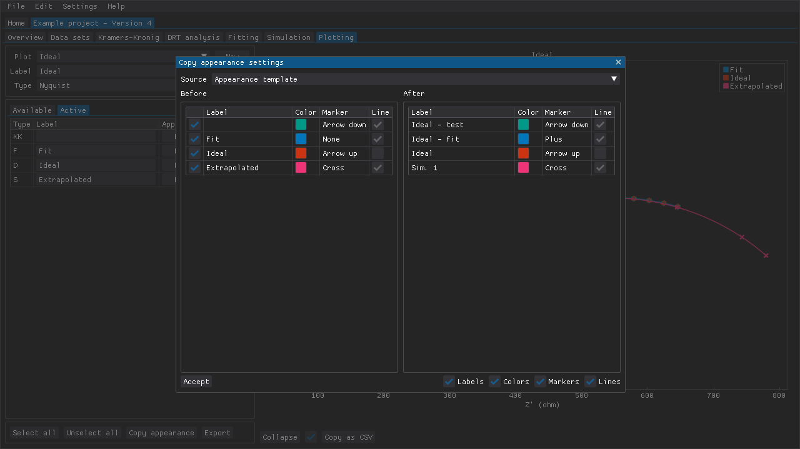
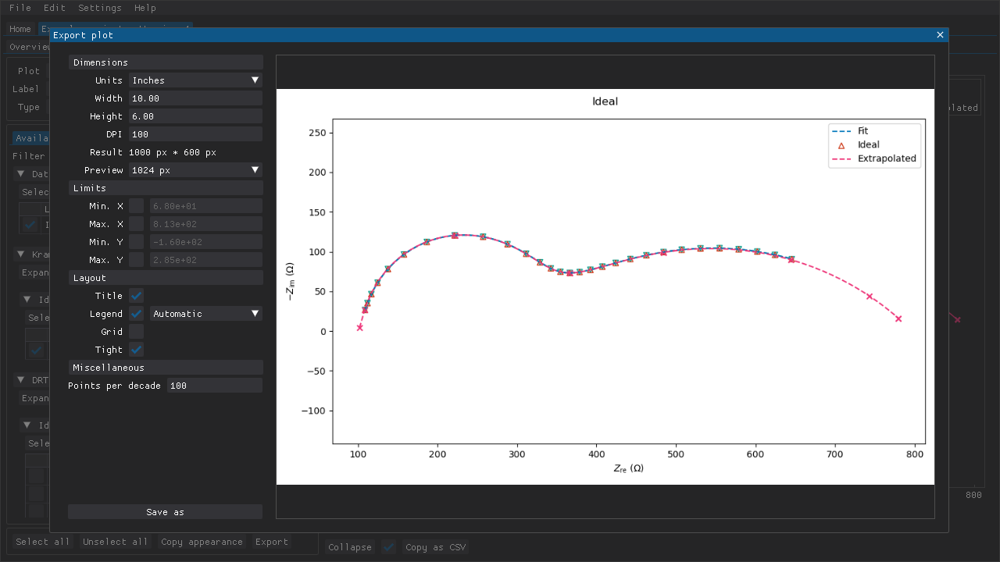

<!--
TODO:
- Creating plots
	- Label
	- Plot types
	- Selecting available items
		- Filter
	- Active items
		- Label overrides
		- Item appearance
		- Item position
- Copying item appearances from one plot to another
- Exporting plots
- Screenshot(s)
-->

**Table of Contents**

- [Creating plots](#creating-plots)
- [Copying appearance settings quickly](#copying-appearance-settings-quickly)
- [Exporting plots](#exporting-plots)

## Creating plots

The `Plotting` tab is intended for comparing multiple results by overlaying them on top of each other in a plot (see figure below):

  1. Section for creating, deleting, and naming plots. The plot type can also be selected.
  2. Section for selecting items to plot (data sets, Kramers-Kronig test results, etc.). Includes a text input for filtering items (if you just type a space, then all of the collapsing headers expand).
  3. Buttons for (un)selecting all items, for copying the appearances (markers, colors, etc.) from another plot, and for exporting the plot to a file.

Figure: Example of the plotting tab with the `Available` items tab visible. A data set, a Kramers-Kronig test result, a fitted circuit, and a simulated response have been selected. The filtering capability has been used to only show one data set and its corresponding analysis results.

A few plot types are available:

- Nyquist (-Z" vs Z')
- Bode, magnitude (|Z| vs frequency)
- Bode, phase (-phase vs frequency)
- Real impedance (Z' vs frequency)
- Imaginary impedance (-Z" vs frequency)
- Distribution of relaxation times (gamma vs tau)

Items that one wishes to plot can be chosen from the `Available` tab.
The `Filter` input field can be used to only show relevant items in this section, which makes it easier to add/remove specific items.
For example, typing in `ideal` in the example above resulted in the `Ideal data` data set being visible in this section.
The Kramers-Kronig test result(s), DRT analysis results, and equivalent circuit fitting results for that data set are also visible.

Items that have been chosen are added to the `Active` tab (see figure below):

  1. The type of item (D for data set, KK for Kramers-Kronig test result, etc.).
  2. Label override for a specific plot. Typing a space omits the item from the plot legend while still plotting the item itself.
  3. Edit the appearance of the item (color, marker, etc.).
  4. Adjust the order in which the items are plotted (`U` and `D` to move the item up and down, respectively).

Figure: Example of the plotting with the `Active` items tab visible.

## Copying appearance settings quickly

If you want to items to have consistent appearances across multiple plots, then the `Copy appearance` button can help you accomplish this quickly.
You can create a plot that is purely for defining the appearance of each item (e.g., name it `Appearance template`).
Create the various other plots that you want to have.
Go back to the `Appearance template` plot and define each item's appearance.
Go through each of the other plots one by one, click `Copy appearance` (see figure below for an example of the window that should show up), select `Appearance template` as the source (if it isn't already the default due to the alphabetic sorting), and click `Accept`.
If you change an item's appearance, then you will need to repeat the previous step but that should still be a lot faster than making the changes manually in each plot.

Figure: Example of the window for copying appearance settings from another plot.

It is also possible to selectively copy appearance settings for some items by (un)checking the checkboxes on the left-hand side of the window.
Alternatively, you can also choose to only copy certain settings by (un)checking the check boxes in the lower, right-hand corner of the window.

## Exporting plots

The plots created in the `Plotting` tab can also be exported as files by clicking the `Export` button.
The plots are then rendered using [matplotlib](https://matplotlib.org/ as the backend.
The size and resolution can be defined and certain aspects of the plot (e.g., legend and plot title) can be adjusted to some extent.

Figure: Example of the plot exporting window.

The window can provide a preview of the plot.
For the sake of performance, the preview dimensions can be limited to a smaller size.
However, the preview might look very different from the final product if the final dimensions are much larger than the preview dimensions.

**IMPORTANT!** The preview functionality is known to cause segmentation faults when clearing the preview (e.g., when updating the preview or when closing the window) on some systems, which causes DearEIS to crash.
This issue seems to affect at least some Linux systems using certain graphics card drivers.
There is a setting in the `Settings - Defaults` section that can be used to disable the clearing of the preview texture and thus also avoid the crash.
However, this will cause the program to leak memory whenever the plot preview is updated.