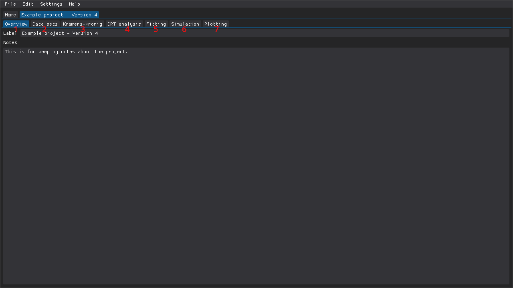

<!--
TODO:
- Redo Home tab screenshot
-->

**Table of Contents**

- [Creating projects](#creating-projects)
- [Loading and saving projects](#loading-and-saving-projects)
- [Project file format](#project-file-format)

## Creating projects

The first thing you'll want to do when you've launched DearEIS for the first time is to create a project.
DearEIS uses a project-based workflow where each project can contain multiple data sets (i.e., impedance spectra), analysis results, etc.
Projects can be created via the `New project` button at the bottom of the `Home` tab (see figure below), the `File` menu at the top of the program window, the [hotkey](settings.md) assigned to that action, or the [command palette](command-palette.md).

   1. `File` menu: create/load/save/close a project or close the program.
   2. `Edit` menu: undo/redo actions.
   3. `Settings` menu: change settings related to plot appearance, default settings, and keybindings.
   4. `Help` menu: information about the program and links to documentation.
   5. `Load` button: load this recent project.
   6. `New project` button: create a new project.
   7. `Load project(s)` button: load projects either by first selecting one or more recent projects (checkboxes on the right-hand side), or by using the file selection window.
   8. `Merge projects` button: merge two or more projects either by first selecting one or more recent projects (checkboxes on the right-hand side), or by using the file selection window.
   9.  `Clear recent projects` button: clear the list of recent projects or only the selected recent projects (checkboxes on the right-hand side).

Multiple projects can be open at the same time and are added to the top-most tab bar (i.e., the one that contains the `Home` tab in the figure below).

Figure: The `Home` tab, which contains a list of recent projects.

Each project has the following tabs (see figure below):

  1. `Overview`: Set the project label and write notes.
  2. `Data sets`: Load and process experimental data.
  3. `Kramers-Kronig`: Test the validity of data sets using Kramers-Kronig transforms.
  4. `DRT analysis`: Calculate the distribution of relaxation times in data sets.
  5. `Fitting`: Fit equivalent circuits to data sets.
  6. `Simulation`: Simulate the impedance spectra of circuits.
  7. `Plotting`: Prepare plots that can be used to, e.g., compare multiple data sets or analysis results.

Figure: The `Overview` tab of a project.

## Loading and saving projects

Projects can be loaded and saved via the `File` menu at the top of the program window, the [hotkeys](settings.md) assigned to those actions, or the [command palette](command-palette.md).
Recent projects can also be loaded from the `Home` tab, which contains a list of recent projects.
Projects with unsaved changes are indicated by the color of their tab changing to red and saving the project changes the color to blue.
DearEIS saves snapshots every N actions (configurable in the settings) and also saves a snapshot of any open projects with unsaved changes when the program is shut down.
These snapshots are then recovered the next time that DearEIS is launched.
However, this system is not perfect and serious errors, such as segmentation faults, can prevent DearEIS from saving a snapshot.

## Project file format

Projects are saved as Javascript Object Notation (`.json`) files.
New versions of DearEIS may change the structure of the project files (e.g., to support a new feature).
Loading an old project file in a newer version of DearEIS may thus cause the project file to be updated to a new version when the project is saved.
It will then no longer be possible to open the project file in an older version of DearEIS.
