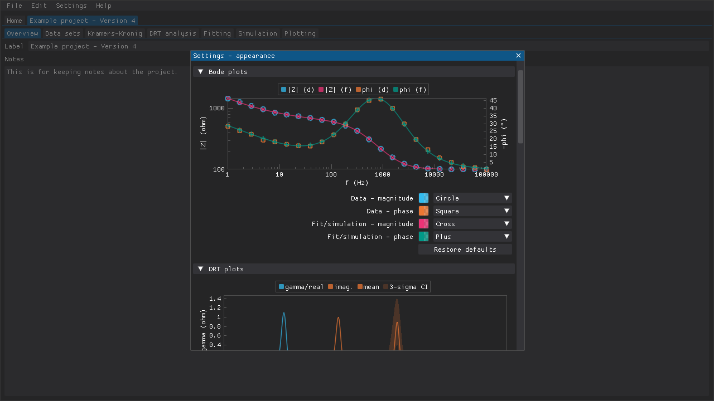
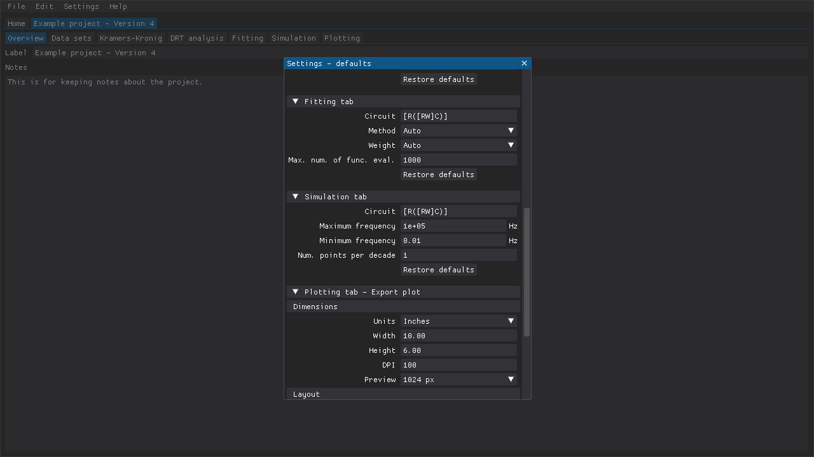
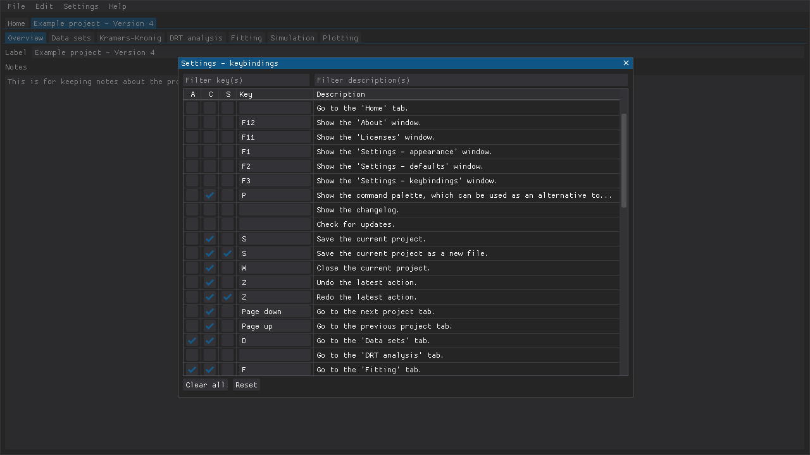

<!--
TODO:
-->

**Table of Contents**

## Appearance settings

Several settings related to the appearances of the various plots can be defined.
These settings should make it easier for people with some form of color vision deficiency to use the program.

Figure: The various appearance settings include the colors and markers used in, e.g., Bode plots.

## Project defaults

The default settings in the various project tabs, such as the circuit fitting settings, can be defined in the `Settings - appearance` window.

Figure: The various default settings to use when creating a new project or loading a project can be defined in the `Settings - defaults` window.

## Keybindings

Most of the various actions that can be performed in DearEIS (e.g., perform test, switch to the next tab) can be assigned hotkeys.
In some cases there are non-rebindable hotkeys such as `Esc` for closing a modal window.
The `Alt`, `Ctrl`, and `Shift` modifier keys can be used in the keybindings.
A keybinding can be searched for either based on the keys assigned to the keybinding or the description of the action.

Figure: The keybindings are presented as a list that can be searched/filtered based on the assigned keys or the description of the action.
