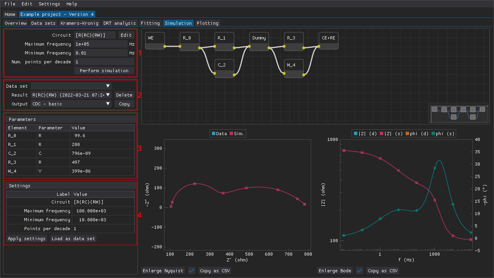
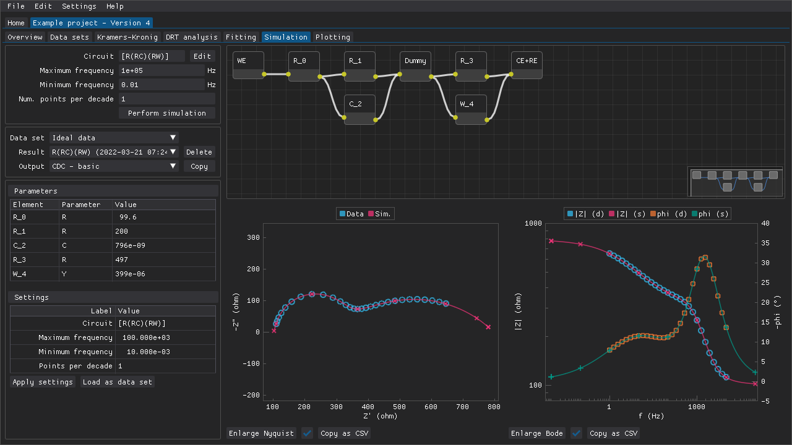

**Table of Contents**

- [Performing simulations](#performing-simulations)
- [Applying old settings](#applying-old-settings)
- [Loading results as data sets](#loading-results-as-data-sets)
- [Copying results to the clipboard](#copying-results-to-the-clipboard)

## Performing simulations

The `Simulation` tab is where the impedance responses of circuits can be simulated for a wide range of frequencies and number of points per decade (see figure below):

  1. the various settings that determine how the simulation is performed
  2. combo boxes that can be used to choose the active overlaid data set, the active simulation result, and the active output (buttons for deleting the active fit simulation and for copying the active output are also included)
  3. the parameter values of the elements present in the simulated circuit
  4. the settings that were used to obtain the active result

Figure: The `Simulation` tab of a project.

This tab can be useful for educational purposes (e.g., demonstrate the Nyquist plot of how two parallel RC circuits connected in series look depending on how similar their time constants are).
Alternatively, the impedance response of a fitted circuit can be extrapolated by copying the extended CDC from a fit result from the `Fitting` tab.
The circuits are constructed in the same way as in the [`Fitting` tab](fitting.md).

The results are presented in the form of a table containing the parameter values, two plots (Nyquist and Bode), and a preview of the circuit that was simulated.

Figure: A data set can be overlaid on top of the simulated response of a circuit.

## Applying old settings

The settings that were used to perform the active simulation result are also presented as a table and these settings can be applied by pressing the `Apply settings` button.

## Loading results as data sets

Simulation results can also be added to a project as a data set via the `Load as data set` button.
DRT analyses can then be performed on the simulated data set.

## Copying results to the clipboard

Some results can be copied to the clipboard in different plain-text formats via the `Output` combo box and the `Copy` button.
Many of the same outputs available in the [`Fitting` tab](fitting.md) are also available for simulation results.